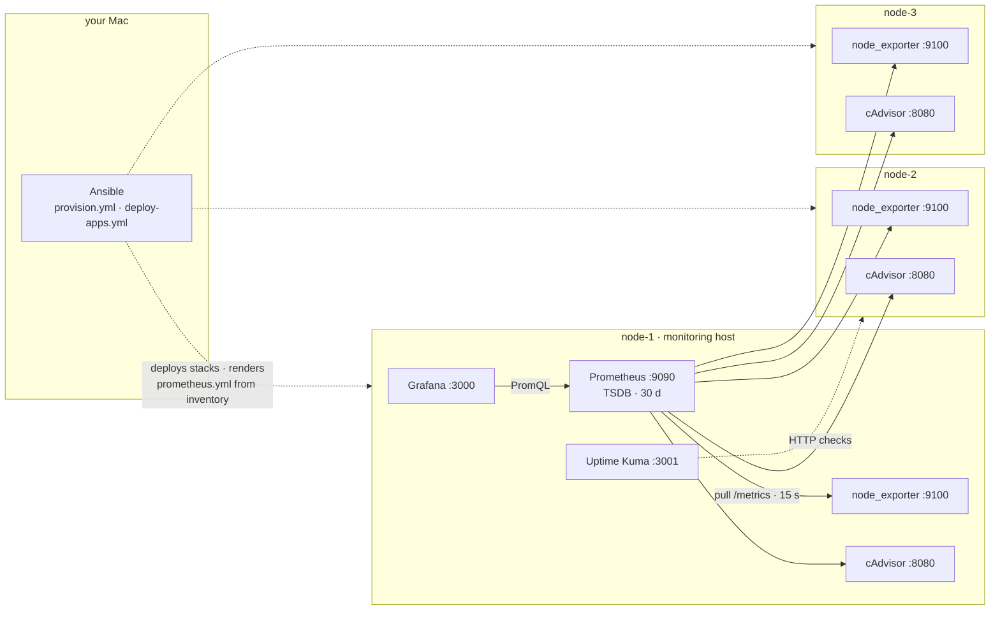
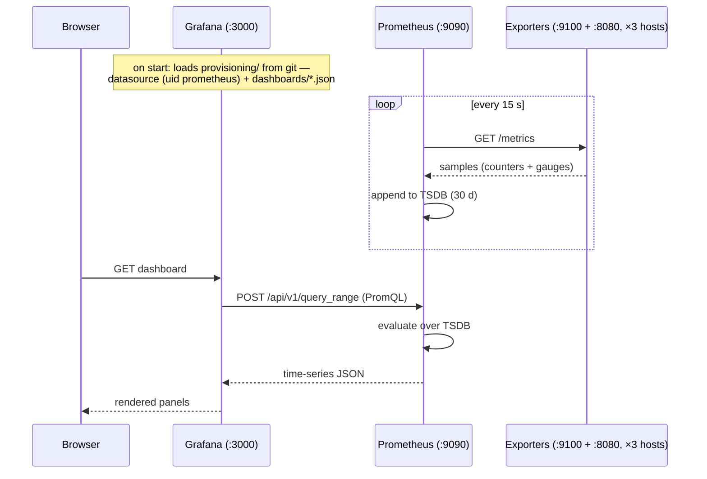
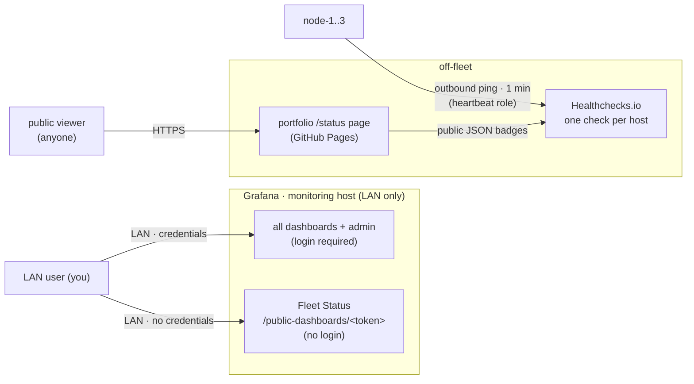

# Monitoring architecture

How metrics move across the 3-node fleet, and who can see what. Nodes are
named generically here (`node-1..3`); real hostnames and IPs live in the
gitignored inventory and `host_vars/` (`node_name` becomes the `node`
label on every scrape target, so dashboards show a hostname instead of a
scrape address).

## Core architecture

Everything is pull-based: exporters sit passively on every host, the one
Prometheus reaches out to all of them, and Grafana only ever talks to
Prometheus.

Adding a host to the Ansible inventory adds its scrape targets on the next
deploy — the inventory is the service registry.

## Sequence: from scrape to rendered panel

Two independent rhythms: the scrape loop runs forever in the background;
the query path runs only when someone opens a dashboard. A scrape gap
shows up as a gap in the graph, never as an error.

## Access paths: private vs public

The pipeline above is shared; what differs per audience is the way in.
Grafana (including the tokenized no-login Fleet Status URL) stays
LAN-only. The world-facing view is deliberately **off-fleet**
([../DECISION.md](../DECISION.md) #3): a status page must not share fate
with the thing it reports on — during a full-fleet power loss an
on-fleet page is unreachable, not red.

Rules for the public path:

- Nothing inbound is exposed: hosts *push* heartbeats outward; the status
  page and its truth source are both hosted off-fleet, so a fleet-wide
  outage renders as red rows, not a dead link.
- Two kinds of Healthchecks URLs, never confused: **ping URLs are
  secrets** (anyone holding one can fake "up") and live in gitignored
  `host_vars/`; **badge URLs are public read-only** (revocable keys) and
  may be committed to the portfolio repo.
- Fleet Status keeps carrying only public-appropriate data (up/down,
  uptime, availability, CPU/memory %) so it *could* be exposed later, but
  today it is LAN-only; its share token can be revoked any time.
- Internet tunnels are deferred until an app genuinely needs inbound
  traffic (e.g. Jellyfin away from home). When that day comes: tunnel →
  nginx path-allowlist gate → app, so no login page ever faces the
  internet.

## Endpoints

| Service | Where | Port | Serves |
|---|---|---|---|
| Grafana | monitoring host | `:3000` | dashboards; Fleet Status also at the public token URL |
| Prometheus | monitoring host | `:9090` | metric store + query API, 30-day retention |
| Uptime Kuma | monitoring host | `:3001` | up/down checks and notifications |
| node_exporter | every host | `:9100` | host metrics — systemd service, survives Docker outages |
| cAdvisor | every host | `:8080` | per-container metrics |

## Known limits

- **Single point of failure:** Prometheus, Grafana and Uptime Kuma all run
  on one host. Accepted for now — the stack is code, so re-assigning it in
  `host_vars` and re-running `deploy-apps.yml` rebuilds it elsewhere in
  minutes; only TSDB history is lost. The off-fleet dead-man's switch
  (heartbeat role + Healthchecks.io) covers *knowing about* an outage;
  still planned: a duplicate Prometheus on a second host for metrics
  continuity.
- **Private-cloud plane:** when the Incus cluster lands (see
  [../ROADMAP.md](../ROADMAP.md)), its metrics endpoint becomes one more
  scrape job — per-VM metrics with no agents inside guest VMs and no holes
  in the guest-network firewall.
